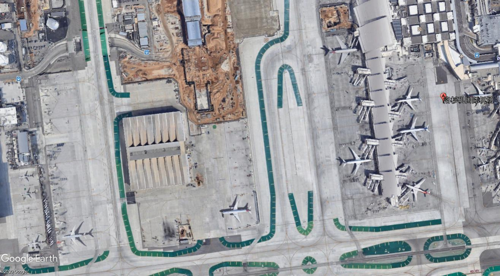
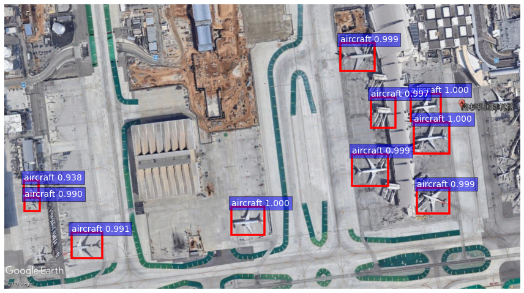

* 本项目基于https://github.com/dBeker/Faster-RCNN-TensorFlow-Python3

  具体操作步骤均见其README文档

* 我们的工作

  * 收集数据集：Google Earth采集（数千张） + lableImg打标签
  * 训练模型 以 识别光谱图像中的飞机【output和default文件夹】
  * 开发应用网站

* 2020年大创项目

* 完成时间：2019年12月~2020年10月

* 网络模型：Faster-RCNN

* [Faster-RCNN-TensorFlow-Python3]为本地源码

* [website_version]为部署到远程nginx服务器的源码，文件夹中只保留了[Faster-RCNN-TensorFlow-Python3]中的demo.py

* [网页设计并部署到服务器.md]为部署到服务器时的笔记

* [website_version]中[demo.py]为部署到远程nginx服务器的源码；相交于本地版本的demo.py主要修改了路径名；路径名的修改在Line 115/120 ```file = "/var/www/html/upload/"+str(args.inputimg)```

* 效果图展示

  

  